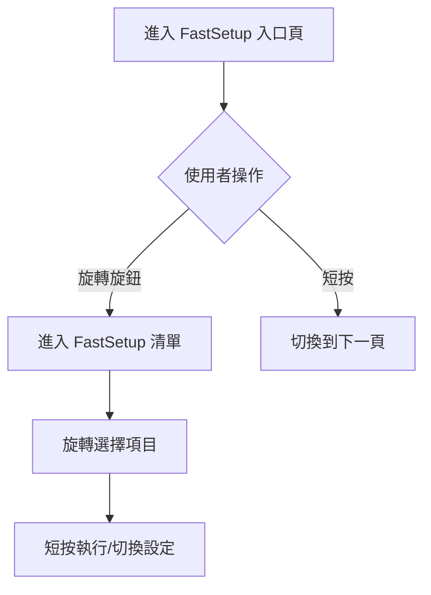
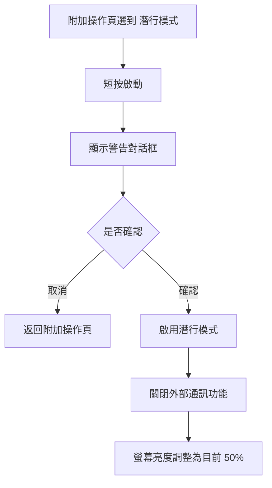

<div align="center" markdown="1">


<h1>HermesX Firmware</h1>


[](https://github.com/OLDWAYS069/HermesX/actions/workflows/main_matrix.yml)
[](LICENSE)


</div>

<div align="center">
  <a href="https://github.com/OLDWAYS069/HermesX">Repository</a>
  -
  <a href="docs/README.md">Documentation</a>
  -
  <a href="docs/CHANGELOG_MINI.md">Changelog</a>
</div>

> 在沒有網路或行動訊號的時候，HermesX 讓 LoRa 裝置仍能「看得見、操得到、傳得出去」。

HermesX 是基於 Meshtastic 的客製化韌體，重點放在「不用拿手機也能操作」的本機 UI/UX。
本專案針對旋鈕操作、畫面提示、聲光回饋與快捷功能頁做了大量調整，讓裝置在外勤場景中更直覺。

## Overview
- 以 Meshtastic 為核心通訊能力
- 強化本機操作（旋鈕 / 按鍵 / 畫面 / 蜂鳴器 / LED）
- 針對 HermesX 硬體使用情境做 UI 與互動優化
- 專注於「無手機操作」與外勤場景的快速交互

## Get Started
- `Build`：`platformio run -e heltec-wireless-tracker`
- `Docs`：`docs/README.md`
- `Changelog`：`docs/CHANGELOG_MINI.md`、`docs/REF_changelog.md`
- `Release Tag`：使用 `Released`（Annotated Tag）

## 目前版本與分支
- `Released`：正式釋出標記（Tag）
- `HermesX_0.2.9_Civ`：Civ 版分支（已排除 EMAC 功能，並關閉 Lighthouse）


## 功能展示
### 快速設定 FastSetup
- 旋轉才進入設定，降低誤觸風險。
- 短按可略過設定，直接切頁。
- 適合外勤中快速查看與調整常用選項。

### 附加操作頁（快捷功能）
- 將「緊急照明燈」與「潛行模式」從 FastSetup 分離。
- 使用滾動式選單操作，行為與 FastSetup 一致。
- 最上層提供「返回」（切到下一頁）作為安全出口。

### 潛行模式保護流程
- 啟用前跳出警告框，提醒將關閉外部通訊能力（含藍牙）。
- 啟用後自動降亮度至目前值 50%，降低可見度。
- 對話框排版已針對小螢幕做過擠壓/遮擋修正。

### 訊息通知不搶畫面
- 新訊息到達時不強制跳回 LOGO 主頁。
- 以底部頁面指示點閃爍提示，保留使用者當前操作上下文。

## 操作流程圖（Mermaid）
### FastSetup 入口流程


### 潛行模式啟用流程


## HermesX UI 改動（重點）
以下為相較原始 Meshtastic 韌體，HermesX 在 UI/操作上的主要差異：

### 1. FastSetup（快速設定）體驗改造
- 入口不再直接進入清單，而是先顯示大型圖示頁（螺母/設定提示）。
- 畫面提示「旋轉已進入設定」的操作概念。
- 使用者旋轉旋鈕時才進入原本 FastSetup 選單。
- 短按可直接切換到下一頁，不強制進設定。

### 2. 獨立操作頁（附加頁面）
- 新增獨立的滾動式操作頁（不放在主 LOGO 頁直接觸發）。
- 操作方式比照 FastSetup，透過旋鈕滾動選單進行。
- 頁面頂層提供「返回」（實際行為為切到下一頁）。
- 該頁面設計為不觸發罐頭訊息模組。

### 3. 緊急照明燈（Emergency Light）
- 從 FastSetup 分離，改放在獨立操作頁中管理。
- 與其他快捷功能同頁操作，避免混在設定項目中。

### 4. 潛行模式（Stealth Mode）
- 從 FastSetup 分離，改放到與緊急照明燈同一個操作頁。
- 啟用前會跳出確認對話框，避免誤觸。
- 對話框包含保護提示與確認流程（含延遲保護機制）。
- 啟用後自動將螢幕亮度調整為目前亮度的 `50%`。
- 已修正對話框文字過度擁擠與與下排提示重疊問題。

### 5. 新訊息通知行為
- 收到新訊息時不再強制跳回 LOGO 頁。
- 改為使用底部頁面指示點的閃爍提示，降低畫面被搶走的情況。

### 6. 全域蜂鳴器控制
- `UI設定` 中的 `EMUI蜂鳴器` 已調整為控制全域蜂鳴器行為。

## 其他 HermesX 互動特性
- **專注的操作體驗**：可透過本機直接瀏覽/發送罐頭訊息。
- **視覺 + 聽覺雙通知**：LED 與蜂鳴器同步回饋送達、失敗、接收狀態。
- **HermesX 品牌化 UI**：畫面表情、提示與互動流程做了統一。
- **安全喚醒流程**：長按電源具備可視化進度，降低誤觸啟動風險。

## LED 狀態條行為
| 狀態 | 顏色與動畫 | 說明 |
| --- | --- | --- |
| 待機 | 橘色燈條、有一顆亮點來回移動 | 裝置處於待命但可立即操作。 |
| 發送訊息 | 白色亮點自下而上流動 | 目前正在發送使用者選定的訊息。 |
| 接收訊息 | 白色亮點自上而下流動 | 收到其他節點的訊息。 |
| 收到節點資訊 | 綠色亮點自上而下流動 | 發現或更新網路節點資訊。 |
| 傳訊成功 | 綠燈閃爍三次 | 訊息已獲確認。 |
| 傳訊失敗 | 紅燈閃爍三次 | 訊息未成功送達，請重試。 |

## 旋鈕操作
- **旋轉**：瀏覽頁面或移動選單項目。
- **按下**：執行目前選定的功能 / 發送目前選定的罐頭訊息。
- **長按**：控制開機與關機。

## 建置與燒錄（PlatformIO）
- 預設環境：`heltec-wireless-tracker`
- 編譯：

```bash
platformio run -e heltec-wireless-tracker
```

- 韌體輸出位置（常用）：
  - `.pio/build/heltec-wireless-tracker/firmware.bin`
  - `.pio/build/heltec-wireless-tracker/firmware.factory.bin`
  - `.pio/build/heltec-wireless-tracker/bootloader.bin`
  - `.pio/build/heltec-wireless-tracker/partitions.bin`


## 外觀設計
外殼預留勾槽，可搭配 D 扣或掛繩將 HermesX 固定於背包、胸掛、皮帶或褲子，方便隨身攜帶。

## 其他特點
- 支援 18650 電池快速更換，延長外勤續航。
- 防潑水設計（請勿浸泡）。

## 售價
先行者套件價格為 3000 元 / 台，含完整保固服務。

## HermesX Agents 指南
- **核心命名習慣**：以 HermesX 為主要前綴，涵蓋類別（如 `HermesXInterfaceModule`、`HermesFace`）、工具（`HermesXPacketUtils`）與記錄（`HermesXLog`）；功能掛鉤採語意化命名（`setNextSleepPreHookParams`、`runPreDeepSleepHook`）；以大寫宏 `MESHTASTIC_EXCLUDE_HERMESX` 控制編譯範圍。
- **Hermes 介面 Agent** (`src/modules/HermesXInterfaceModule.*`、`HermesFace*`、`TinyScheduler.h`)：處理表情動畫、旋鈕交互與電源提示，公共 API 包含 `startPowerHoldAnimation`/`updatePowerHoldAnimation`/`stopPowerHoldAnimation`，資源依 `HermesFaceMode` enum 命名。
- **按鍵與輸入 Agent** (`ButtonThread.*`、`input/RotaryEncoderInterruptBase.*`)：擴充 `HermesOneButton` 型別別名、`HoldAnimationMode` 狀態與備援 `BUTTON_PIN_ALT` 喚醒；事件函式統一為 `userButtonPressedLongStart/Stop`、`rotaryStateCW` 命名，並透過 Hermes 介面更新動畫。
- **通信可靠度 Agent** (`mesh/ReliableRouter.*`)：新增 `ReliableEventType` enum、`ReliableEvent` 結構與 `setNotify`/`emit` 回呼，命名以用途為主（`ImplicitAck`、`GiveUp`），`hermesXCallback` 事件橋接 ACK/NACK。
- **模組註冊 Agent** (`modules/Modules.cpp`)：維持 Hermes 模組建立序列，命名遵循 `moduleName = new Hermes...`，加入 `LighthouseModule`、`MusicModule` 等依功能命名的模組。
- **睡眠控制 Agent** (`sleep.*`、`sleep_hooks.*`、`Power.cpp`、`platform/esp32/main-esp32.cpp`)：調整喚醒路徑，公開變數 `g_ext1WakeMask`/`g_ext1WakeMode`，函式以動作描述命名（`setNextSleepPreHookParams`、`consumeSleepPreHookParams`），`BUTTON_PIN_ALT` 判斷邏輯獨立。
- **UI 與資源 Agent** (`graphics/Screen.cpp`、`graphics/img/icon.xbm`、`modules/CannedMessageModule.*`)：統一 Hermes 面板、圖示與提示文字命名（`HermesX_DrawFace`、`HermesFaceMode::Sending`），訊息發送改走 `RX_SRC_USER`，臨時訊息以 `temporaryMessage` 命名。
- **外部通知 Agent** (`modules/ExternalNotificationModule.cpp`)：保留 `hermesXCallback` 呼叫點與 `setExternalState` 命名，確保與 Hermes UI/LED 同步。
- **設定與總覽** (`platformio.ini`、`.vscode/settings.json`、`README.md`)：命名以環境或品牌為核心（`default_envs = heltec-wireless-tracker`、README 標題 `HermesX Firmware`），新增旗標時使用 `BUTTON_PIN_ALT`、`LIGHTHOUSE_DEBUG` 等突顯用途的名稱。
- 後續延伸時，保持上述前綴、語意化函式與枚舉的命名模式，即可維持 HermesX 分支的一致性。
