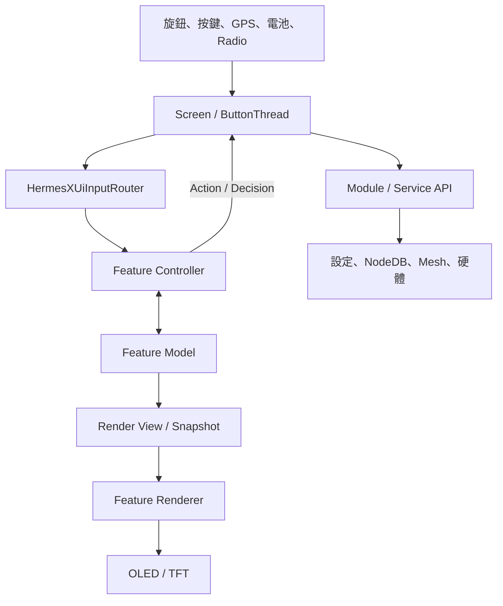

# HermesX 新版專案架構

> 文件基準：`HXB_C0.4.0` CIV 架構重整版，工作分支 `HermesX_C0.3.7`，2026-08-31
> 主要硬體目標：Heltec Wireless Tracker
> 驗證韌體：`HXB_C0.4.0_20260831_2258`

## 1. 改版目的

舊架構將畫面狀態、輸入判斷、繪圖、設定存取及硬體副作用集中在
`src/graphics/Screen.cpp`。功能雖然可運作，但檔案過大、輸入優先權不易追蹤，
而且修改單一畫面容易影響其他頁面。

新版架構保留 Meshtastic 原本的 `Screen` 生命週期，將 HermesX 功能拆成可辨識的責任層：

- `Screen`：裝置與上游 UI 的整合協調者。
- `HermesXUiInputRouter`：統一決定目前由哪個畫面接收輸入。
- `Model`：保存功能自己的 UI 狀態。
- `Controller`：解讀輸入並產生狀態轉換或動作結果。
- `Renderer`：只根據顯示資料繪圖。
- `Presenter` / `StateCollector`：處理 Direct TFT 顯示生命週期與硬體資料轉換。
- Module / Service：執行設定保存、Mesh 傳送、NodeDB、無線電及其他副作用。

這不是將 `Screen.cpp` 完全移除，而是讓它回到「協調」角色，不再擁有每項功能的全部細節。

## 2. 整體分層



| 層級 | 主要位置 | 可以做什麼 | 不應該做什麼 |
|---|---|---|---|
| 裝置整合 | `Screen.cpp`、`ButtonThread.cpp` | 收集裝置狀態、喚醒螢幕、切頁、執行硬體副作用 | 長期保存各功能的 cursor、draft 或 popup 狀態 |
| 輸入路由 | `HermesXUiInputRouter.*` | 依可見層級選出唯一輸入目標 | 直接改設定或繪圖 |
| UI Model | `HermesX*UiModel.*` | 保存頁面、選項、popup、cache 與時間狀態 | 直接操作 OLED、Radio 或檔案 |
| UI Controller | `HermesX*UiController.*` | 解讀按鍵／旋鈕、更新 Model、回傳 Action | 直接執行跨模組硬體副作用 |
| UI Renderer | `HermesX*UiRenderer.*` | 使用唯讀 state/view 繪圖 | 讀 NodeDB、全域設定、寫偏好或送 Mesh 封包 |
| 資料轉換 | `*StateCollector.*`、`*DataSource.*` | 將硬體或資料庫資料整理成 UI 可用快照 | 承擔畫面導航 |
| Direct TFT | `*DirectPresenter.*`、`*DirectRenderer.*` | 管理直繪進出、快取、palette 與局部重繪 | 接管全域輸入路由 |
| 服務層 | `src/modules/` | 設定保存、綁定、Mesh、NodeDB、Radio 與硬體操作 | 包含畫面座標與繪圖細節 |

## 3. 統一輸入流程

所有 HermesX 裝置輸入仍先進入 `Screen`，但不再讓多個功能同時自行判斷事件。

```text
InputEvent
  → Screen 建立 HermesXUiInputState
  → HermesXUiInputRouter::selectTarget()
  → 唯一的 Feature Controller / handler
  → Action 或 Decision
  → Screen 執行必要副作用與 redraw
```

目前輸入優先權由高到低為：

1. Update Modal
2. Low Memory Reminder
3. Rotary Lock Popup
4. Emergency Confirm
5. Finder Pulse Confirm / Sending
6. TraceRoute Popup
7. Setup Detail Popup
8. Incoming Text Popup
9. TAK Mode
10. Action Page
11. FastSetup
12. Recent Message List / Detail
13. Finder、Online、TraceRoute、Group 的 List / Detail

新增 overlay 時，必須同時確認繪圖順序與輸入優先權一致。不可只增加畫面，卻讓底層頁面仍收到輸入。

## 4. HermesX UI 功能切片

HermesX UI 元件集中於 `src/graphics/hermesx_ui/`。

| 功能 | Model / 狀態 | Controller | Renderer / Presenter | `Screen` 保留責任 |
|---|---|---|---|---|
| 訊息 | `HermesXMessageUiModel`、`HermesXDirectMessageComposer` | `HermesXMessageUiController` | `HermesXMessageUiRenderer` | Mesh 發送、頁面切換 |
| TraceRoute | `HermesXTraceRouteUiModel` | `HermesXTraceRouteUiController` | `HermesXTraceRouteUiRenderer` | 路由請求與跨模組副作用 |
| Online / Finder / GROUP | `HermesXNodeBrowserUiModel` | `HermesXNodeBrowserUiController` | `HermesXNodeBrowserUiRenderer` | Lighthouse、GROUP 設定與切頁 |
| 節點資料來源 | — | — | `HermesXNodeBrowserDataSource` | 提供 NodeDB 來源與動作執行 |
| FastSetup | `HermesXFastSetupUiModel` | `HermesXFastSetupUiController` | `HermesXFastSetupUiRenderer` | 寫入設定、OTA、WiFi、Radio |
| Home | `HermesXHomeUiModel` | `HermesXHomeUiController` | `HermesXHomeUiRenderer`、`HermesXHomeDirectPresenter`、`HermesXHomeDirectRenderer` | 取樣 RTC、電池、GPS 與角色資料 |
| GPS | `HermesXGpsUiModel` | `HermesXGpsUiController` | `HermesXGpsUiRenderer`、`HermesXGpsDirectPresenter`、`HermesXGpsDirectRenderer` | 取樣 GPS 與 config |
| TAK Mode | `HermesXTakModeUiModel` | `HermesXTakModeUiController` | `HermesXTakModeUiRenderer` | profile、Radio、重開機及功能啟動 |
| Detail Popup | `HermesXDetailPopupModel` | `HermesXDetailPopupController` | 共用 FastSetup renderer | popup 內容來源與 redraw |
| Low Memory | `HermesXLowMemoryUiModel` | `HermesXLowMemoryUiController` | `HermesXLowMemoryUiRenderer` | Heap 門檻、NodeDB 清理與保護策略 |
| Emergency Confirm | `HermesXEmergencyConfirmUiModel` | `HermesXEmergencyConfirmUiController` | `HermesXEmergencyConfirmUiRenderer` | `ButtonThread` 倒數、提示音與 EM 啟動 |
| Rotary Lock | `HermesXRotaryLockUiModel` | `HermesXRotaryLockUiController` | `HermesXRotaryLockUiRenderer` | 螢幕喚醒、立即重繪與公開 API |

## 5. Home 與 GPS 的 Direct TFT 路徑

Home 與 GPS 除了一般 OLED frame callback，還有直接寫入 TFT 的快速路徑。這條路徑使用較細的分工：

- `StateCollector`：把 RTC、GPS、電池及設定轉為穩定快照。
- `UiModel`：比較新舊快照、保存 cache、決定 dirty 狀態。
- `UiController`：決定是否可進入直繪、FPS、刷新週期及失效條件。
- `DirectPresenter`：管理進入／離開直繪、清屏、palette 與 UI 重新初始化。
- `DirectRenderer`：執行實際圖層與局部重繪。
- `HermesXNeonWorkspace`：管理 Neon glyph cache、暫存空間及 paint run。
- `HermesXDirectTftPrimitives`：提供 Home 與 GPS 共用的裁切與圖形 primitive。

Low-memory 判斷仍由 `Screen` 協調，避免 renderer 自行決定釋放全域資源。

## 6. 資料與副作用邊界

UI Controller 回傳 Action，`Screen` 再呼叫服務層。這能讓導航邏輯與硬體操作分離。

目前已建立的服務邊界包括：

- `HermesXPreferences`：集中布林偏好讀寫，UI renderer 不直接開啟 `/prefs`。
- `HermesXTraceRouteBindings`：負責 TraceRoute 綁定節點載入、去重、容量限制與保存。
- 既有 HermesX modules：負責 Emergency、Lighthouse、Interface、Update、Battery Protection 等功能。

以下操作應留在 `Screen` 或 Module / Service：

- Mesh 封包發送與 TraceRoute 請求。
- NodeDB 查詢、刪除與持久化。
- Radio、GPS、WiFi、MQTT 及裝置設定變更。
- 蜂鳴器、LED、電源、螢幕喚醒與重新啟動。
- OTA 檢查、下載與上傳流程。

## 7. `Screen.cpp` 現在的角色

`Screen.cpp` 目前仍約 15,000 行，因為它同時承接上游 Meshtastic 多板型畫面生命週期與 HermesX 整合點。
行數大不等於功能仍全部塞在其中；判斷是否需要再拆，應看責任而不是只看行數。

應保留在 `Screen` 的內容：

- 上游 `OLEDDisplayUi` frame 註冊與生命週期。
- 裝置全域物件取樣及 feature availability 判斷。
- 統一輸入路由的 state 組裝與 Action dispatch。
- frame 切換、螢幕喚醒、framerate 與 immediate redraw。
- 呼叫 Module / Service 的副作用。
- OLED 與 Direct TFT 路徑之間的整合。

若一段程式只處理單一功能的 cursor、popup、draft、輸入方向或純繪圖，應移入該功能元件。

## 8. 目錄結構

```text
src/
├── graphics/
│   ├── Screen.cpp / Screen.h          # 上游生命週期與 HermesX 整合協調
│   ├── hermesx_ui/                    # HermesX UI 功能元件
│   │   ├── HermesXUiInputRouter.*     # 統一輸入目標選擇
│   │   ├── HermesX*UiModel.*          # 功能狀態
│   │   ├── HermesX*UiController.*     # 輸入與狀態轉換
│   │   ├── HermesX*UiRenderer.*       # 純顯示
│   │   ├── HermesX*StateCollector.*   # 裝置資料轉換
│   │   ├── HermesX*DirectPresenter.*  # Direct TFT 生命週期
│   │   └── HermesX*DirectRenderer.*   # Direct TFT 繪圖
│   ├── hermesx_input/                 # 注音組字與候選字核心
│   └── fonts/HermesX_zh/              # HermesX 中文字型
└── modules/
    ├── HermesXPreferences.*           # UI 偏好服務
    ├── HermesXTraceRouteBindings.*    # TraceRoute 綁定持久化
    ├── HermesXInterfaceModule.*       # HermesX 介面與狀態整合
    ├── HermesXUpdateManager.*         # 更新流程
    └── HermesX...                     # 其他功能與硬體副作用
```

## 9. 新增或修改 UI 功能的規則

1. 先定義功能自己的 State / Model，不在 `Screen.h` 增加一組零散欄位。
2. 將按鍵、旋鈕與導航判斷放入 Controller。
3. Controller 回傳明確 Action；副作用由 `Screen` 或 Service 執行。
4. Renderer 僅接收唯讀 state、view、row provider 或窄 callback。
5. Renderer 不可直接依賴 `ButtonThread`、NodeDB、全域 `moduleConfig` 或 `screen` singleton。
6. 新 overlay 必須加入 `HermesXUiInputState`、Target 與優先權判斷。
7. 繪圖層級和輸入優先權必須一致。
8. 共用文字排版優先使用 `HermesXTextLayout`，不要複製 UTF-8 截斷或換行函式。
9. 偏好與持久化放入 service，不讓 UI 元件直接操作檔案。
10. 每個切片完成後至少執行 `git diff --check` 與主要板型完整建置。

## 10. 驗證基準

主要建置指令：

```bash
platformio run -e heltec-wireless-tracker -j 4
```

`HXB_C0.4.0_20260831_2258` 已完成全量建置；Emergency Confirm 與 Rotary Lock
的新 Model、Controller、Renderer 也已出現在最終 `firmware.elf` 符號表中。

編譯成功只證明程式已整合，不等於完整實機驗證。涉及旋鈕、長按、popup timeout、EM 倒數、
Radio/GPS 或重開機保存的修改，仍需在 Heltec Wireless Tracker 上執行操作回歸。

## 11. 架構完成度

目前主要 HermesX UI 已完成分層，`Screen` 不再是每項功能唯一的狀態、輸入與繪圖擁有者。
後續工作應以修正邊界、降低整合膠水複雜度及增加實機回歸為主，而不是為了縮短檔案盲目拆分。

若未來發現 `Screen` 內仍有完整的單一功能狀態機，可依本文件的 Model／Controller／Renderer
規則逐段移出；上游 frame lifecycle、硬體取樣與副作用 dispatch 則繼續保留。
